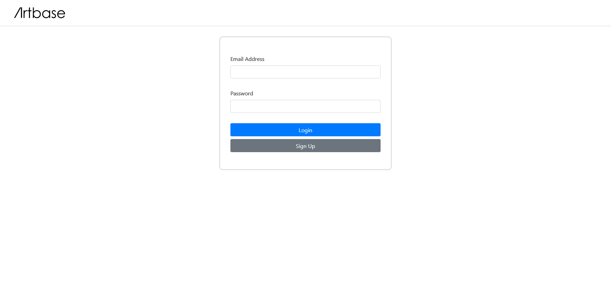
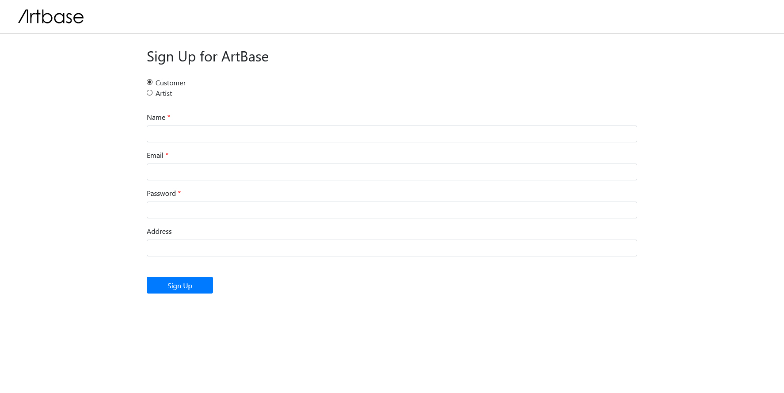
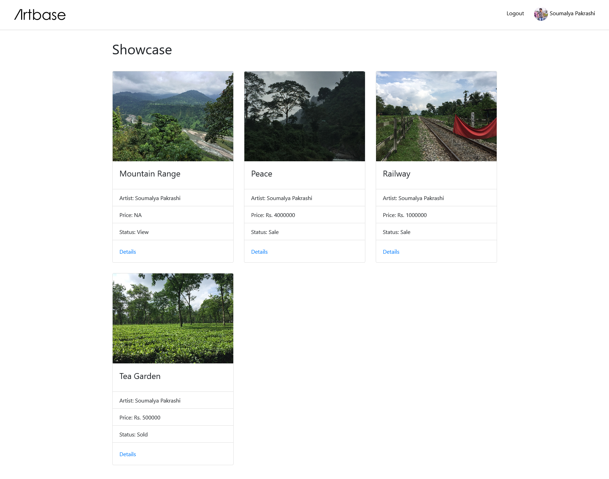

# ArtBase - Lite

## Table of Contents

- [Brief Description](#description)
- [Screenshots](#screenshots)
- [Technologies Used](#technologies-used)
- [Setup](#setup)
- [Social Links](#social-links)
- [Acknowledgements](#acknowledgements)

## Brief Description

ArtBase - Lite represents a very lightweight version of an online art gallery and portraits some of the very essential features any online art gallery should have. The core of this product is a database which captures all the information that galleries need to maintain. Information about artists, their names, birthplace, style of art, etc. are kept.

For each piece of artwork, the artist, the year in which it was made, its unique title, the type of art (eg. painting, lithograph, sculpture, photograph, etc.), its price, etc. are stored. Pieces of artwork are also classified into groups of various kinds such as, portraits, still life, etc. Any artwork can belong to more than one group. Each group is identified by a name that describes the group.

Information about customers such as their name, address, amount spent in the gallery and the artists and groups of artworks each customer likes are also kept. Each transaction (for the procurement of artwork) are recorded.

More requirements can be assumed as required to make the product more realistic.


## Screenshots

Login Page



Sign-Up Page



Showcase Page




## Technologies Used

- CSS Flexbox
- CSS Grid
- Bootstrap
- Font Awesome
- PHP
- MySQL


## Setup

1. Install and setup the latest version of [XAMPP](https://www.apachefriends.org/index.html) if not done already.

2. Download and install the latest version of [Git](https://git-scm.com/) if not done already.

3. Clone this repository in the htdocs folder (or any subfolder in the htdocs folder) which is present in the xampp installation folder.
```
git clone https://github.com/soumalyapakrashi/artbase-lite
```

4. Now, it is time for setting up the database. Open phpmyadmin from the browser by entering the URL "localhost/phpmyadmin" and execute the SQL queries given in the 'database_setup.sql' file present in the setup folder.

5. Now setup the confidential information required. Create a new file named "CREDENTIALS.php" in the root project directory. <br><br>First setup the $host variable. This is the hostname of the server. For local servers, this can be setup as follows:

```php
$host = "localhost";
```

Then setup the $user variable. This refers to the MySQL user from which account the database is being operated. Substitute this value with your username.

```php
$user = "iamuser";
```

Then the $password variable. This refers to the password of the corresponding user account.

```php
$password = "mysecurepassword";
```

Then declare the $dbname variable. This refers to the name of the database used. This should be equal to the database name given in the 'database_setup.sql' file. In this case, it is 'artbase' but if you decide to change it, be sure to change it in both the places.

```php
$dbname = "artbase";
```

When an artwork or the picture of an artist is uploaded, it is stored somewhere in the server. This location where the images are stored are specified by the variables $artist_picture_dir and $artwork_picture_dir. Some good examples are given as follows but if you decide to change them, be sure to add that folder to the .gitignore file as this folder does not need to be version controlled or uploaded to any public platform.

```php
$artist_picture_dir = "uploads/artist/";
$artwork_picture_dir = "uploads/artworks/";
```

6. Finally open the index.php file from the browser by entering the appropriate URL. The URL should start with 'localhost' if a local environment is used as the PHP file cannot be opened directly in the browser and a server has to be used (Apache in this case if XAMPP is being used).


## Social Links

- GitHub - [soumalyapakrashi](https://github.com/soumalyapakrashi/)
- Twitter - [@iamspakrashi](https://twitter.com/iamspakrashi)
- Facebook - [Soumalya Pakrashi](https://www.facebook.com/soumalya.pakrashi.1/)


## Acknowledgements

1. [University of Calcutta](https://www.caluniv.ac.in/) Computer Science Department Faculty for providing and supporting in the development of this project.

2. The [ArtLogic Website](https://artlogic.net/) from which the logo has been inspired and reproduced.

3. [Debaleena Talukdar](https://github.com/debaleenatalukdar) and [Vaishali Mondal](https://github.com/vaishalimondal1998) for helping in the requirements analysis and database design of this project.
